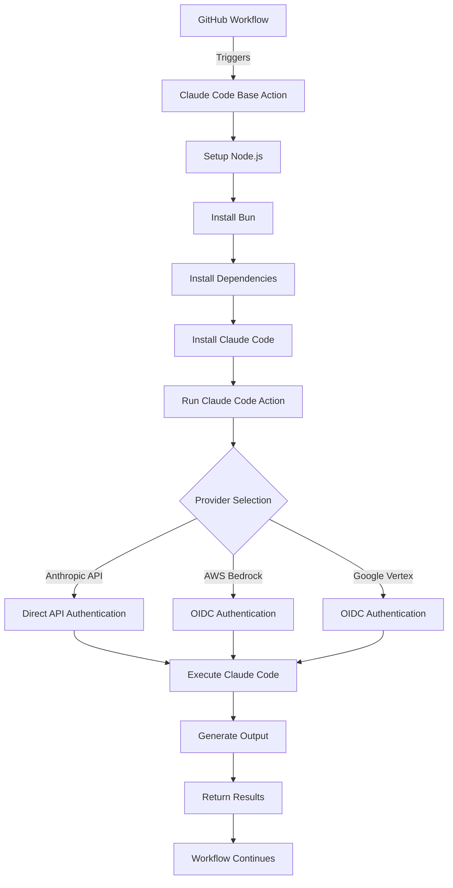
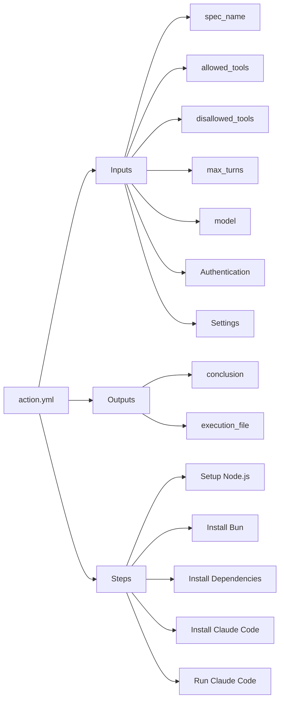
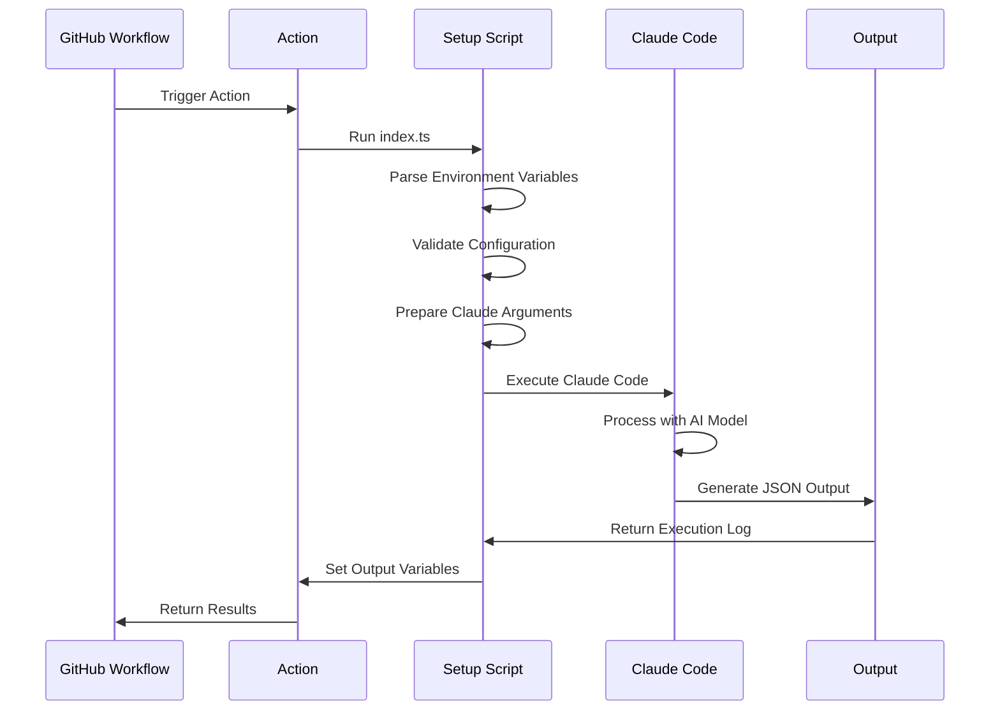
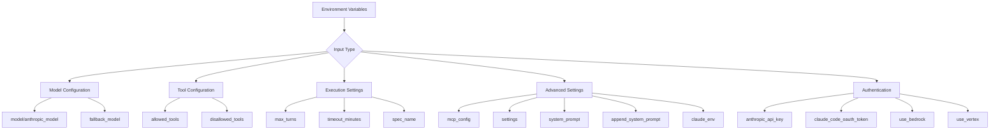
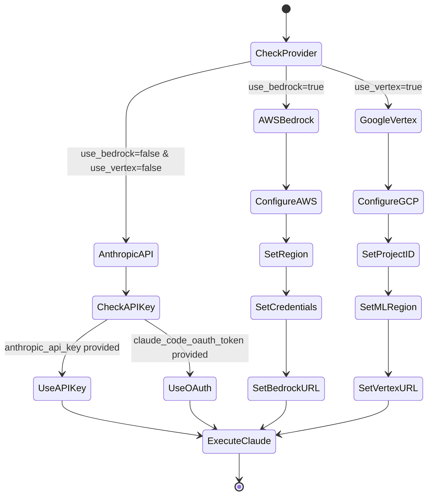
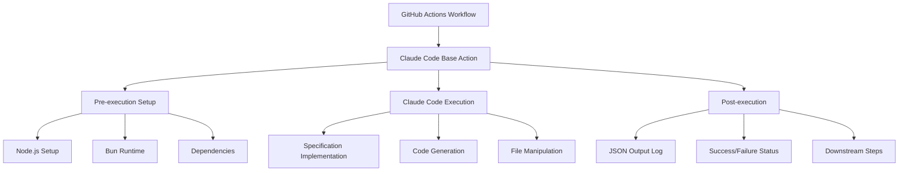

# Claude Code Base Action - Detailed Architecture

## Overview

The Claude Code Base Action is a GitHub Action that enables running Claude Code within GitHub workflows. It provides a seamless way to integrate AI-powered code assistance into your CI/CD pipelines.

## Architecture Flow



## Component Details

### 1. Action Definition (`action.yml`)

The action is defined as a composite action with the following structure:



### 2. Execution Process (`src/index.ts`)

The main execution script handles:



### 3. Input Processing

The action processes various types of inputs:



### 4. Provider Authentication Flow



### 5. Output Generation

```mermaid
graph LR
    A[Claude Execution] --> B[JSON Output]
    B --> C[/tmp/claude-execution-output.json]

    C --> D[Parse Results]
    D --> E[Extract Conclusion]
    D --> F[Set File Path]

    E --> G[Output: conclusion]
    F --> H[Output: execution_file]

    G --> I[GitHub Workflow]
    H --> I
```

## Key Features

### 1. Multi-Provider Support

The action supports three AI providers:

- **Anthropic API**: Direct API access with API key authentication
- **AWS Bedrock**: AWS-hosted Claude models with OIDC authentication
- **Google Vertex AI**: Google Cloud-hosted Claude models with OIDC authentication

### 2. Flexible Configuration

- **Model Selection**: Choose specific Claude models with fallback options
- **Tool Control**: Allow or disallow specific Claude Code tools
- **Execution Limits**: Set maximum conversation turns and timeouts
- **Custom Prompts**: Override or append to system prompts
- **Environment Variables**: Pass custom environment variables to Claude

### 3. Integration Points



## Usage Examples

### Basic Usage

```yaml
- uses: anthropics/claude-code-base-action@v1
  with:
    spec_name: "user-authentication"
    anthropic_api_key: ${{ secrets.ANTHROPIC_API_KEY }}
```

### Advanced Configuration

```yaml
- uses: anthropics/claude-code-base-action@v1
  with:
    spec_name: "payment-integration"
    model: "claude-3-opus-20240229"
    fallback_model: "claude-3-sonnet-20240229"
    allowed_tools: "Read,Write,Edit"
    max_turns: "10"
    timeout_minutes: "15"
    anthropic_api_key: ${{ secrets.ANTHROPIC_API_KEY }}
```

### AWS Bedrock Usage

```yaml
- uses: anthropics/claude-code-base-action@v1
  with:
    spec_name: "data-pipeline"
    use_bedrock: "true"
    model: "anthropic.claude-3-opus-20240229-v1:0"
  env:
    AWS_REGION: "us-east-1"
```

## Technical Implementation Details

### 1. Named Pipes (FIFO)

The action uses named pipes for inter-process communication between the prompt preparation and Claude execution.

### 2. JSON Streaming

Execution logs are streamed as JSON to provide structured output that can be parsed by subsequent workflow steps.

### 3. Timeout Enforcement

The action wraps Claude Code execution in a timeout command to ensure workflows don't hang indefinitely.

### 4. Error Handling

The action captures both successful completions and failures, providing appropriate exit codes and status outputs.

## Security Considerations

1. **API Key Management**: API keys should be stored as GitHub secrets
2. **OIDC Authentication**: Bedrock and Vertex use temporary credentials via OIDC
3. **Tool Restrictions**: Use allowed_tools/disallowed_tools to limit Claude's capabilities
4. **Environment Isolation**: Each execution runs in an isolated GitHub runner environment
